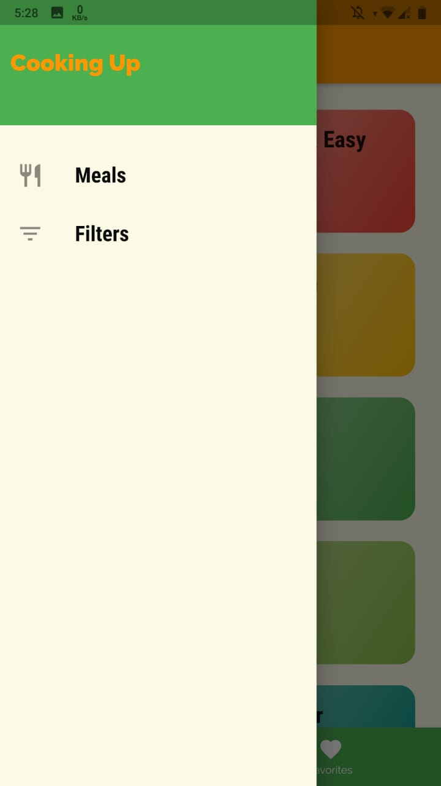
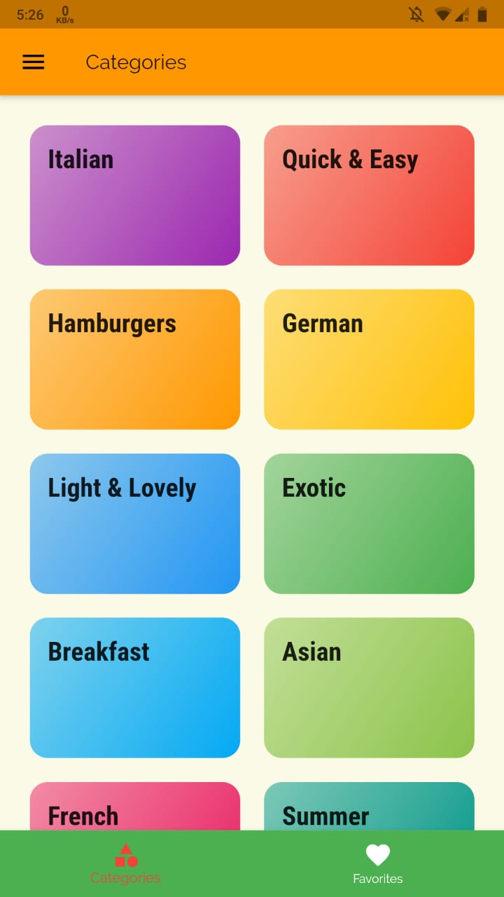
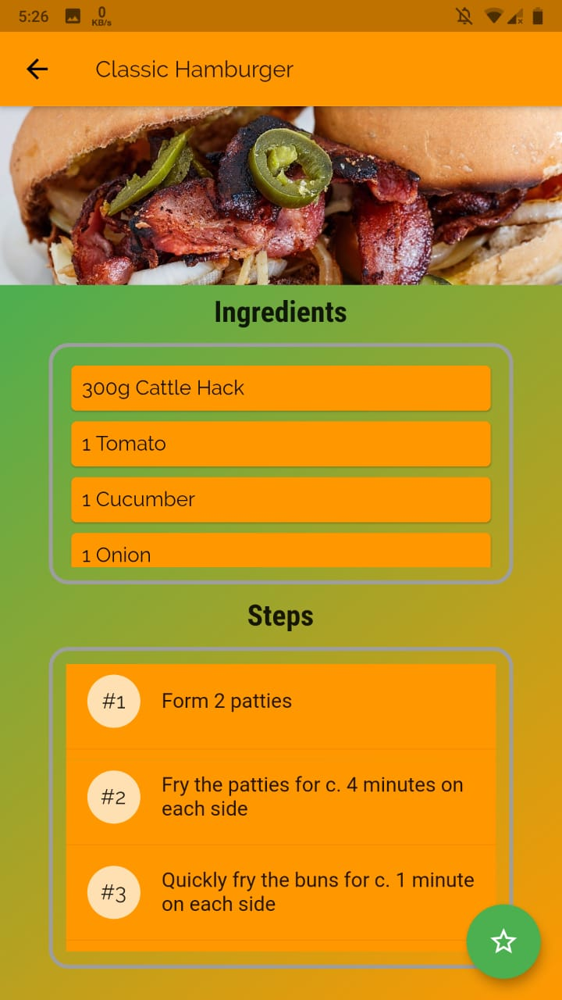
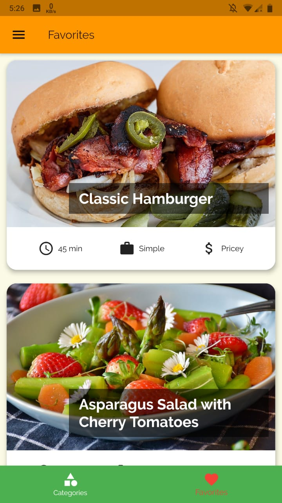
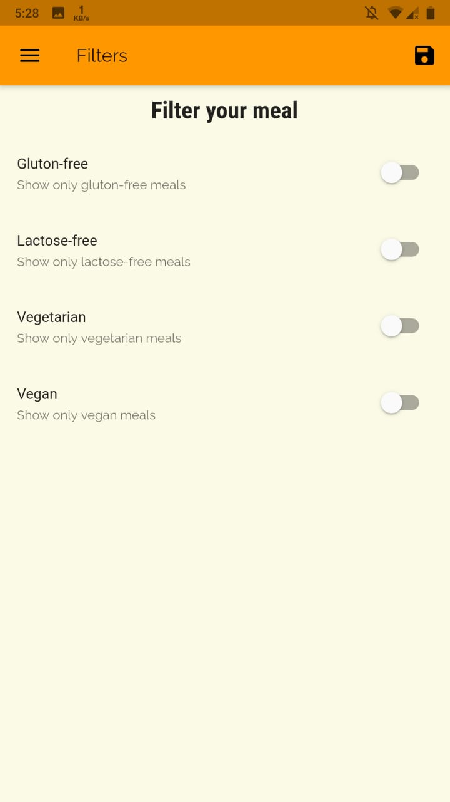

# Meals App

An app build on Flutter

Look for meal recipes, choose your favorite meals!

## Contents

**Multiple Screens**: Multiple Screens using *MaterialPageRoute*

**Drawer**: A Drawer to choose between favorites and all meals

**Categories**: Categories for different meal types

**Meals**: A screen dedicated to each meal about its recipe

**Favorites**: A meal can be added to favorites using *FloatingActionButton* on the screen of each meal

**Filters**: Filter your meals for *gluten-free*, *lactose-free*, *vegetarian* and *vegan*!

**Tabs**: Tabs sceen to choose between *Favorites* screen and *Categories* screen
